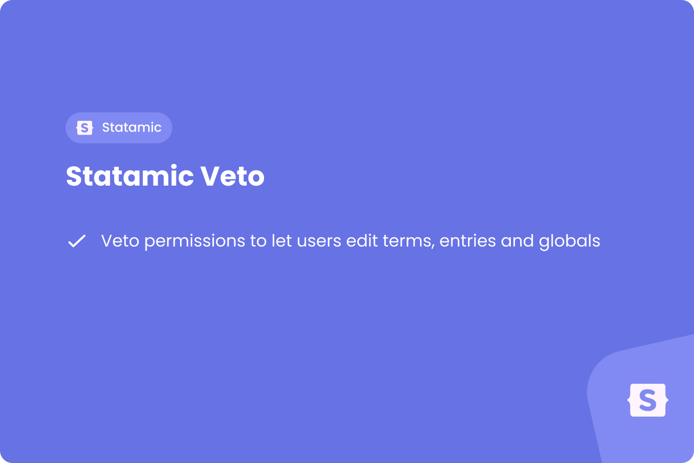

# Statamic Veto

<a href="https://justbetter.nl" title="JustBetter">
    
</a>

<p>
    <a href="https://github.com/justbetter/statamic-veto"></a>
    <a href="https://github.com/justbetter/statamic-veto"></a>
    <a href="https://github.com/justbetter/statamic-veto"></a>
    <a href="https://github.com/justbetter/statamic-veto"></a>
</p>

A Statamic addon that adds permissions to grant roles the ability to edit all globals, terms, or entries, where it ussually is specific for every type of global, taxonomy or collection.

## Requirements

- Statamic v6
- Laravel v12
- PHP 8.3+

## Features

This package adds three powerful permissions to your Statamic roles:

- **Edit all globals** - Grant a role permission to edit all global sets
- **Edit all terms** - Grant a role permission to edit all taxonomy terms
- **Edit all entries** - Grant a role permission to edit all entries across collections

These permissions work alongside Statamic's existing permission system, allowing you to give roles blanket access to edit all content of a specific type without needing to configure permissions for each individual item.

## Installation

Install the package via Composer:

```bash
composer require justbetter/statamic-veto
```

Publish the configuration file:

```bash
php artisan vendor:publish --provider="JustBetter\Veto\ServiceProvider" --tag="config"
```

## Usage

Once installed, three new permissions become available when editing roles in the Statamic Control Panel:

- `edit all globals` - Allows editing of all global sets
- `edit all terms` - Allows editing of all taxonomy terms
- `edit all entries` - Allows editing of all entries

Simply assign these permissions to any role, and users with that role will gain the corresponding access. These permissions work in addition to Statamic's existing permission system, so users will have access if they either have the veto permission or the standard Statamic permission for a specific item.

### Configuration

You can customize the permission names in the published configuration file at `config/statamic-veto.php`:

```php
return [
    'permissions' => [
        'global' => 'edit all globals',
        'entry' => 'edit all entries',
        'term' => 'edit all terms',
    ],
];
```

## Quality

To ensure the quality of this package, run the following command:

```bash
composer quality
```

This will execute three tasks:

1. Makes sure all tests are passed
2. Checks for any issues using static code analysis
3. Checks if the code is correctly formatted

## Contributing

Please see [CONTRIBUTING](.github/CONTRIBUTING.md) for details.

## Security Vulnerabilities

Please review [our security policy](../../security/policy) on how to report security vulnerabilities.

## Credits

- [Bob Wezelman](https://github.com/BobWez98)
- [All Contributors](../../contributors)

## License

The MIT License (MIT). Please see [License File](LICENSE) for more information.

<a href="https://justbetter.nl" title="JustBetter">
    
</a>
